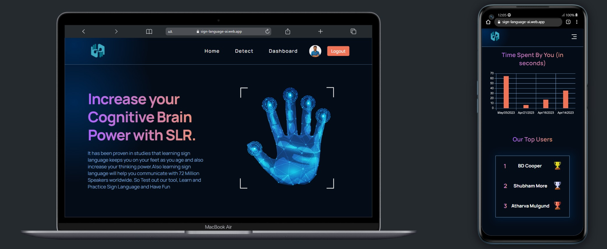

<<<<<<< HEAD
# Intelligent-Systems-for-healthcare-and-medical-Diagnosis-
=======
# **Sign Language Recognition for Deaf and Dumb**

- Our sign language recognition project involved creating a custom dataset, preprocessing images, training a model, integrating with React, and hosting with Firebase. 

- The result is a real-time sign language recognition application that recognizes a variety of sign language gestures.

- Our Model is trained for 26 alphabets and 16 words of ASL and which are commonly used in general communication.

## Features

- Real-Time Recognition

- Easy-to-Use Interface

- Adaptive Learning

- High Accuracy

- Real Time User Progress Data

## Tech Stack

**Front-end:**

- React
- Redux

**Back-end:**

- Firebase (for hosting, authentication, and storage)

**Machine Learning Framework:**

- MediaPipe

**NPM Packages:**

- @mediapipe/drawing_utils
- @mediapipe/hands
- @mediapipe/tasks-vision
- @redux-devtools/extension
- chart.js
- firebase
- js-cookie
- react-chartjs-2
- react-icons
- react-redux
- react-router-dom
- react-toastify
- react-webcam
- redux
- redux-thunk
- uuid

## Team Members

- So this project is a group project done in collaboration with the members mentioned below.

| Name              | Email-id                      |
| :--------------   | :---------------------------- |
| Shivam kumar yadv | `shivam.yadv784@gmail.com`  |
| Sunidhi pathak     | `Sunidhipathak639@gmail.com`      |
| Mohammed raiyan   | `mohammedraiyan1101@gmail.com` |

## Acknowledgements

- [React](https://react.dev/)
- [mediapipe](https://developers.google.com/mediapipe)
- [Firebase](https://firebase.google.com/)
- [NPM](https://www.npmjs.com/)

>>>>>>> fde5500 (initial commit)
